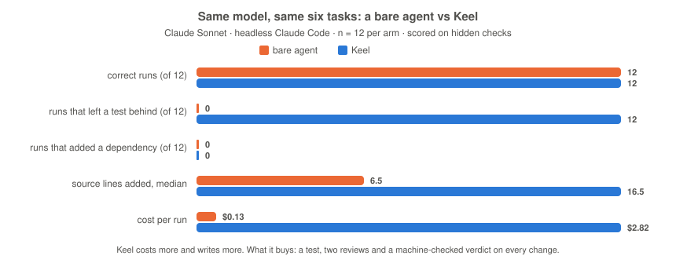

<div align="center">


<h1 align="center">Keel</h1>

<p align="center">
  <em>The harness that makes your AI coding agent prove its work before anything ships.</em>
</p>

<p align="center">
  <a href="https://claude.com/claude-code"></a>
  <a href="#install"></a>
  <a href="CONTRIBUTING.md"></a>
</p>

<p align="center">
  <strong>Failing test first &middot; secrets and force-pushes blocked &middot; every review machine-checked &middot; "done" means the docs agree</strong><br>
  <sub>Enforced by hooks and scripts, not by asking nicely: 238 golden tests prove each gate blocks what it should and allows what it should. Drop it into any repo, any language, in four commands.</sub>
</p>

<p align="center">
  <a href="#install">Install</a> &middot;
  <a href="#how-it-works">How it works</a> &middot;
  <a href="#commands">Commands</a> &middot;
  <a href="docs/OVERVIEW.md">Overview</a> &middot;
  <a href="CHANGELOG.md">Changelog</a>
</p>

</div>

---

An AI coding agent is fast, tireless, and confidently wrong just often enough to hurt you. It says
"done" with no test. It pastes a key into a fixture. It force-pushes. It builds a 120-line class
where one line would do, and then reviews itself and approves.

Keel is a `.claude/` directory that changes that. It is the staff engineer who has been paged for
every shortcut anyone ever took: the one who asks where the test is, will not merge on the model's
own word, and will not let "done" be declared while the docs say otherwise. Not by prompting — by
hooks that block, scripts that decide, and a linter that keeps the whole thing small enough to read
on every turn.

## What you get

- **Tests before code, every time.** The loop is RED → GREEN → REFACTOR; a change with no failing
  test behind it does not count as done.
- **Gates that block, not warn.** Commits to `main`, force-pushes, secrets in a diff, and pushes
  that skip the status doc are refused by hooks — the agent cannot talk its way past a script.
- **Review the model cannot rubber-stamp.** Up to two independent reviewers return a JSON verdict;
  a script, not the model, decides whether it merges.
- **A ladder against over-building.** Does it need to exist, is it already here, stdlib,
  platform, installed dependency, one line — asked before any new code, and again of every review
  ask; every corner deliberately cut carries a `debt:` marker with the trigger to revisit it.
- **A budget for context.** Under 3,700 always-on words, enforced by the linter; everything else
  loads on demand, so the agent stays sharp on turn forty.
- **Six things only a human can trigger.** Ship, release, rollback, sync, ADR, intake — the model
  cannot invoke them at all.

## Before / after

Same request, same model. Without Keel the agent edits production code, says "done," and nothing
checked it. With Keel it writes the failing test first, then the diff, then hands you a verdict a
script decided and a four-line report:

```
$ bash .claude/skills/code-review/scripts/check-review.sh < verdict.json
✓ check-review: no blocking findings; verdict approves.

Assumptions:    the caller wants OAuth device-flow login, not password grant
Changed:        src/auth/device_flow.py, tests/test_device_flow.py
Verified:       pytest -q (42 passed) + ruff + mypy — all green, observed
Remaining risk: token refresh path has no property test yet (debt: tracked)
```

## Numbers

Same model, same six tasks, with no harness and with Keel — twelve runs each, scored on hidden
checks the agent never saw:

<p align="center">
  
</p>

| Claude Sonnet, six trap tasks, n = 12 per arm | correct | left a test behind | added a dependency | src LOC (median) |  cost |
| --------------------------------------------- | ------: | -----------------: | -----------------: | ---------------: | ----: |
| **bare agent** (no harness)                   |   12/12 |               0/12 |                  0 |              6.5 | $0.13 |
| **Keel**                                      |   12/12 |              12/12 |                  0 |             16.5 | $2.82 |

Read it straight. On tasks this small a good model does not over-build, so Keel does not win on
lines or price — it costs about twenty times more per change. What it buys, on every one of the
twelve runs and on none of the bare agent's: a failing test written first, two independent
reviews, a verdict a script decided, and a status doc that agrees with the code. Whether that is
worth it depends on what a wrong "done" costs you. Method, raw rows and the earlier ladder evals:
[`docs/benchmarks/`](docs/benchmarks/).

The always-on surface is under 3,700 words, budgeted by the linter; the six human-only workflows
cost zero. The full accounting is in [`docs/OVERVIEW.md`](docs/OVERVIEW.md).

## How it works

Three rules, in priority order:

- **The LLM proposes; deterministic gates decide.** Tests, types, linters and a human decide what
  merges. Model output never crosses into production, money or user data unchecked.
- **Safety is lexicographically prior to speed.** Rolling back is automatic; deploying, deleting
  and force-pushing wait for a gate or a human.
- **Context is a budget.** The always-on surface stays tiny; depth loads on demand; fan-out reading
  goes to subagents that return conclusions, not files.

Every change walks the loop, in order:

```
Research & Reuse → Plan → TDD (RED → GREEN → REFACTOR) → Implement → Review → Verify → Commit & PR → Sync
```

And before writing code, the agent stops at the first rung that holds:

```
1. Does this need to exist?   → no: skip it (YAGNI)
2. Already in this codebase?  → reuse it, don't rewrite
3. Stdlib does it?            → use it
4. Native platform feature?   → use it
5. Installed dependency?      → use it
6. One line?                  → one line
7. Only then: the minimum code that works
```

The ladder sizes the solution, never the loop — a test, a review verdict and a sync are never
simplified away. What the layers are and how they fit: [`docs/OVERVIEW.md`](docs/OVERVIEW.md) and
the harness index, [`.claude/README.md`](.claude/README.md).

## Install

The most effort Keel will ever ask of you:

```bash
git clone https://github.com/kapadias/keel /tmp/keel
cp -r /tmp/keel/.claude .claude && cp /tmp/keel/CLAUDE.md CLAUDE.md
mkdir -p docs && cp /tmp/keel/docs/STATUS.md docs/STATUS.md
chmod +x .claude/hooks/*.sh      # the pre-push gate self-installs at SessionStart
```

Or as a plugin: `/plugin marketplace add kapadias/keel`, then `/plugin install keel@keel`. A plugin
install is **not** equivalent to a copy-in — it cannot carry the permission posture or the other
eight rules — see [`docs/INSTALL.md`](docs/INSTALL.md).

Then open the repo in [Claude Code](https://claude.com/claude-code) and say `/plan add OAuth
device-flow login`. Make it yours in three edits:

- **Your test gate** — copy a pack from [`stacks/`](stacks/) (python · typescript · go · rust), or
  edit [`.claude/skills/test/SKILL.md`](.claude/skills/test/SKILL.md).
- **Your tracker** — the issue prefix in [`.claude/rules/git-workflow.md`](.claude/rules/git-workflow.md).
- **Your formatter** — [`.claude/hooks/format.sh`](.claude/hooks/format.sh) (Python, JS/TS, Go and
  Rust work out of the box).

## Commands

Fifteen workflows, invoked as `/<name>`. The six marked **human-only** cannot be triggered by the
model at all — that is what makes "a human approves promotion" a mechanism, not a request.

| Workflow                     | Does                                                                                      |
| ---------------------------- | ----------------------------------------------------------------------------------------- |
| `/plan`                      | Restate the requirement, research reuse, surface risks, decompose into reviewable steps.  |
| `/tdd`                       | Run RED → GREEN → REFACTOR for a unit of behavior. The default way to build.              |
| `/implement`                 | Write minimal, typed, reviewable code against an existing failing test.                   |
| `/fix`                       | Bounded fast lane for a trivial, reversible fix — `check-trivial.sh` decides eligibility. |
| `/review`                    | Path-aware parallel review — correctness always, security when the change warrants it.    |
| `/audit`                     | Repo-wide over-engineering sweep — ranked cuts plus the `debt:` ledger. Read-only.        |
| `/test`                      | Run the project's lint + type-check + test + coverage gate and summarize.                 |
| `/coverage`                  | Report line + branch coverage; spotlight the survival-critical surface and its gaps.      |
| `/debug`                     | Reproduce → isolate → root-cause → fix the cause → leave a regression test.               |
| `/ship` **(human-only)**     | Full gate → conventional commit → push → PR to `develop`, linked to the issue.            |
| `/release` **(human-only)**  | Promote `develop → main` — human-gated production release with tag + notes.               |
| `/rollback` **(human-only)** | Revert a bad change or roll back a deploy — the risk-reducing counterpart to `/ship`.     |
| `/sync` **(human-only)**     | Reconcile the five mirrors so every record of the system agrees.                          |
| `/adr` **(human-only)**      | Write a numbered Architecture Decision Record with real alternatives.                     |
| `/intake` **(human-only)**   | Turn a raw idea or bug into a well-formed, de-duplicated tracked issue.                   |

Eight model-tiered agents do the work behind them — planner, implementer, test-engineer, two
reviewers, an explorer, a debugger and a router. Who runs on what: [`docs/OVERVIEW.md`](docs/OVERVIEW.md).

## Development

Keel is held to its own bar. Before any change lands:

```bash
bash tests/run.sh              # gate golden tests — each hook proven to block vs. allow
python3 tests/harness_lint.py  # token budgets, stale counts, verdict format, hook wiring
```

CI runs both plus shellcheck over every script. How to add a rule, skill or agent, and why most
additions belong on demand: [`CONTRIBUTING.md`](CONTRIBUTING.md). Vulnerabilities: [`SECURITY.md`](SECURITY.md).

## FAQ

**Is it just a prompt?**
No. Hooks block, tests decide, and the linter budgets the prose. A prompt cannot refuse a push.

**Will this slow me down?**
It front-loads the work that prevents the 3am. A plan, a failing test and a review are cheaper
than debugging in production. Net faster.

**What if I really need to ship without a test?**
You can. On a branch. Behind a `debt:` marker naming when you'll fix it. The gate will be watching.

**Does it lock me into a language?**
No. Three small files name tooling; everything else is principle and transfers unchanged.

**Why "Keel"?**
The part of the ship you never see, and the reason it doesn't tip.

## Credits

The decision ladder, the `debt:` marker convention, the over-engineering review tags and the
subagent context carrier are adapted from [ponytail](https://github.com/dietrichgebert/ponytail)
by Dietrich Gebert (MIT).

## License

[MIT](LICENSE) © 2026 Shashank Kapadia.

## Star History

<a href="https://www.star-history.com/#kapadias/keel&Date">
 <picture>
   <source media="(prefers-color-scheme: dark)" srcset="https://api.star-history.com/chart?repos=kapadias/keel&type=Date&theme=dark" />
   <source media="(prefers-color-scheme: light)" srcset="https://api.star-history.com/chart?repos=kapadias/keel&type=Date" />
   
 </picture>
</a>
