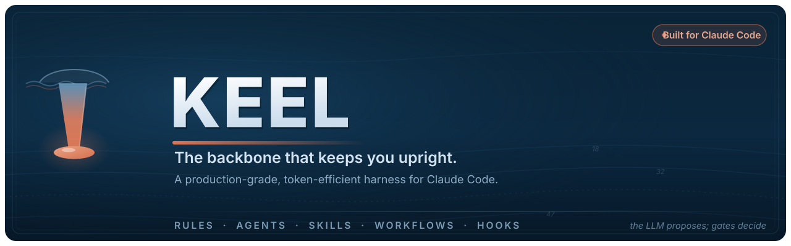

<div align="center">



<br/>

[](https://claude.com/claude-code)
[](LICENSE)
[](#make-it-yours)
[](docs/STATUS.md)
[](CONTRIBUTING.md)

**The backbone that keeps an AI coding agent upright.**
A portable `.claude/` operating system that makes AI-assisted development
**disciplined, test-driven, review-gated, and safe** — without burning your context window.

[Quickstart](#quickstart) · [Philosophy](#the-three-principles) · [What's inside](#whats-inside) · [Token economy](#the-token-economy) · [Commands](#the-pipeline) · [Make it yours](#make-it-yours) · [Changelog](CHANGELOG.md) · [Contributing](CONTRIBUTING.md)

</div>

---

## Why Keel?

An LLM coding agent is fast, tireless, and **confidently wrong** often enough to hurt you. Left
unstructured it will skip the test, swallow the error, refactor and change behavior in the same
breath, push to `main`, and quietly leak a secret into a log — and it will do all of it while sounding
certain.

**Keel is the structural backbone that keeps the agent upright.** A keel is the part of a ship that
resists capsizing under load; this harness is the part of your workflow that resists shipping
untested, unreviewed, or irreversible change under the pressure to move fast. It is a small, opinionated
set of **rules, agents, skills, workflows, and hooks** that drop into any repository's `.claude/`
directory and encode _how the work gets done_.

It is distilled from a harness built for a real-capital systematic-trading operation — where a wrong
number moves money — and generalized for **any software project, in any language**.

> Keel is not a framework you import. It is a set of operating instructions for Claude Code: copy it in,
> adapt three things, and the agent starts working like a disciplined senior engineer.

**The gates are _code_, not prose.** Keel doesn't just tell the agent to behave — it _enforces_ it.
Commits to a protected branch are blocked, secrets are blocked before they hit disk, a turn cannot end
with the Definition of Done stale, and a reviewer that returns prose instead of a machine-checkable
verdict is caught at the boundary. The harness **tests its own gates** (`bash tests/run.sh` — 136
golden tests) so the enforcement can't silently rot.

**What v1.0 adds:** the model can no longer invoke the six workflows that have side effects, a plugin
install finally carries the operating rules it was always missing, and every token budget is enforced
by the linter rather than asserted in a README.

---

## The three principles

Everything in Keel descends from three lines.

### 1. The LLM proposes; deterministic gates decide

An LLM may read code, draft changes, generate hypotheses, and explain. **Tests, types, linters, and
human review decide** whether any of it merges or acts. No unvalidated model output crosses a boundary
that touches production, money, or user data. The sharp test for any design:

> _"If this output is silently wrong, can it cause harm before a deterministic check catches it?"_
> If yes — put a gate between the LLM and the consequence.

### 2. Safety is lexicographically prior to speed

Irreversible and outward-facing actions — deploy, delete, force-push, publish, migrate — are gated
behind tests, review, and (when they widen blast radius) a human. Risk-_reducing_ actions may be
automatic; risk-_increasing_ actions are gated. When "safe" and "fast" disagree, **safe wins, always.**

### 3. Context is a budget — spend it deliberately

The always-on surface stays tiny; depth loads on demand. Token thrift is a first-class design goal —
and it is **never** paid for in quality. (See [The token economy](#the-token-economy).)

---

## The loop

Every change moves through these stages, in order. Speed comes from doing each well once — not from
skipping the ones that catch mistakes.

```
Research & Reuse → Plan → TDD (RED → GREEN → REFACTOR) → Implement → Review → Verify → Commit & PR → Sync
```

---

## What's inside

```
.claude/
├── rules/        always-on operating discipline — dense, short, paid every turn
├── agents/       specialists you delegate to (orchestrator, planner, reviewers, explorer, …)
├── skills/       deep playbooks (load on trigger) + the pipeline: /plan /tdd /review /ship …
│              side-effecting ones are human-invoke-only and cost zero context
├── hooks/        deterministic guards that BLOCK protected-branch commits, secrets, and unsynced pushes
└── settings.json denies reading secrets and force-push; wires the hooks
CLAUDE.md         the always-on root — the agent reads this first
tests/            the harness's own gate tests + self-validation (bash tests/run.sh)
stacks/           ready-made test-gate packs: python · typescript · go · rust
docs/             STATUS.md (the live mirror) + ROADMAP + Architecture Decision Records
```

| Layer                  | Loaded          | Purpose                                                                           |
| ---------------------- | --------------- | --------------------------------------------------------------------------------- |
| `CLAUDE.md` + `rules/` | **Always**      | The dense, short policy the agent obeys every turn.                               |
| `skills/`              | **On demand**   | Playbooks that cost nothing until triggered, plus the `/name` pipeline workflows. |
| `agents/`              | **On delegate** | Specialists that spend _their own_ context and return conclusions.                |
| `hooks/`               | **On event**    | Deterministic enforcement on edit and on push.                                    |

---

## The token economy

Most "AI dev setups" fail the same way: they stuff every instruction into one always-on file. Every
token in that file is re-read on **every** turn, the window fills, and the agent gets duller as the
task gets longer. Keel is built the other way — **progressive disclosure**:

|                 | Always-on (paid every turn)                                                                                                                              | On-demand (paid only when needed)                                         |
| --------------- | -------------------------------------------------------------------------------------------------------------------------------------------------------- | ------------------------------------------------------------------------- |
| **What**        | `CLAUDE.md` + 9 rules, plus the name+description of each skill, agent and workflow                                                                       | 11 skill playbooks + 14 pipeline workflows + 8 agents — bodies only       |
| **Footprint**   | **~6.9k tokens** — 3,599 words of prose (3,700-word budget) + ~1.1k tokens of descriptions (5,600-char budget), both enforced by `tests/harness_lint.py` | the bulk of Keel — loaded only when relevant                              |
| **When loaded** | Every request                                                                                                                                            | Only when a trigger matches, a workflow runs, or a subagent is dispatched |

The six side-effecting workflows (`/ship`, `/release`, `/rollback`, `/adr`, `/sync`, `/intake`) carry
`disable-model-invocation: true`, so they cost **zero** always-on tokens — and Claude cannot invoke
them at all. Only you can.

So **most of Keel's guidance never touches your main context** until the moment it is relevant. The
mechanisms:

- **Tiny always-on core.** Rules state a principle in a sentence and _link_ to the detail — they never
  inline it. The whole standing policy is under 3,700 words, and the linter fails the build above it.
- **Skills load on a trigger.** A 2,000-token debugging playbook costs zero until you are debugging —
  and bundles its scripts/templates so depth loads only when opened.
- **Workflows encode a pipeline once.** `/ship` runs the whole gate-commit-PR-sync sequence; you don't
  re-describe it each time.
- **Subagents do the fan-out.** Need to search 40 files? The `explorer` agent (on a cheap model) burns
  _its_ context and hands back three `path:line` references and an answer — not the file dumps. Your
  main thread keeps the conclusion.
- **Model-tier routing.** Haiku for mechanical fan-out, Sonnet for the build, Opus for review and hard
  reasoning. Cost matched to depth.

> **The one hard line:** token thrift never justifies skipping a test, a review, a validation step, or
> a safety gate. Save tokens on _how you find and present information_ — never on the correctness and
> safety of the work. See [`.claude/rules/token-economy.md`](.claude/rules/token-economy.md).

---

## Quickstart

Keel is files, not a dependency. Adopt it in under a minute — as a copy-in, or as a plugin.

### Option A — copy it in (standalone)

```bash
# From the root of your repository:
git clone https://github.com/kapadias/keel /tmp/keel

# Copy the harness and the root guidance into your repo:
cp -r /tmp/keel/.claude .claude
cp /tmp/keel/CLAUDE.md CLAUDE.md
mkdir -p docs && cp /tmp/keel/docs/STATUS.md docs/STATUS.md

# Make the hooks executable (the pre-push DoD gate self-installs at SessionStart):
chmod +x .claude/hooks/*.sh
```

### Option B — install as a plugin (versioned, shareable)

```
/plugin marketplace add kapadias/keel
/plugin install keel@keel
```

A plugin install brings the agents, skills, commands, and hooks. Plugins don't apply a `settings.json`
permission posture, so copy Keel's secret read-deny list into your own settings — see
[`.claude/settings.json`](.claude/settings.json).

Then open the repo in **[Claude Code](https://claude.com/claude-code)** and try:

```
/plan add OAuth device-flow login
/tdd
/review
/ship
```

That's it — the agent now plans before coding, writes the failing test first, reviews before merge,
and refuses to mark work done while a mirror is out of sync. Next, [make it yours](#make-it-yours).

---

## The pipeline

Fourteen workflows cover the development loop. Invoke them with `/<name>` in Claude Code. They live
under `.claude/skills/` — Claude Code merged custom commands into skills, and only skills support
invocation control. The six marked **human-only** set `disable-model-invocation: true`: Claude cannot
trigger them, which is what makes "a human approves promotion to production"
([`rules/safety.md`](.claude/rules/safety.md)) a mechanism rather than a request.

| Workflow                     | Does                                                                                      |
| ---------------------------- | ----------------------------------------------------------------------------------------- |
| `/plan`                      | Restate the requirement, research reuse, surface risks, decompose into reviewable steps.  |
| `/tdd`                       | Run RED → GREEN → REFACTOR for a unit of behavior. The default way to build.              |
| `/implement`                 | Write minimal, typed, reviewable code against an existing failing test.                   |
| `/fix`                       | Bounded fast lane for a trivial, reversible fix — `check-trivial.sh` decides eligibility. |
| `/review`                    | Path-aware parallel review — correctness always, security when the change warrants it.    |
| `/test`                      | Run the project's lint + type-check + test + coverage gate and summarize.                 |
| `/coverage`                  | Report line + branch coverage; spotlight the survival-critical surface and its gaps.      |
| `/debug`                     | Reproduce → isolate → root-cause → fix the cause → leave a regression test.               |
| `/ship` **(human-only)**     | Full gate → conventional commit → push → PR to `develop`, linked to the issue.            |
| `/release` **(human-only)**  | Promote `develop → main` — human-gated production release with tag + notes.               |
| `/rollback` **(human-only)** | Revert a bad change or roll back a deploy — the risk-reducing counterpart to `/ship`.     |
| `/sync` **(human-only)**     | Reconcile the five mirrors so every record of the system agrees.                          |
| `/adr` **(human-only)**      | Write a numbered Architecture Decision Record with real alternatives.                     |
| `/intake` **(human-only)**   | Turn a raw idea or bug into a well-formed, de-duplicated tracked issue.                   |

---

## The crew

Eight specialist agents, each model-tiered so you never burn a frontier model on mechanical work.

| Agent               | Model  | Role                                                                                    |
| ------------------- | ------ | --------------------------------------------------------------------------------------- |
| `orchestrator`      | Opus   | Router. Decomposes a request and sequences the loop. Read-only; it plans and delegates. |
| `planner`           | Opus   | Read-only. Turns a request into a written plan — risks, decomposition, a gate per step. |
| `implementer`       | Sonnet | Builds features to make failing tests pass. The bulk of engineering.                    |
| `test-engineer`     | Sonnet | Writes the failing tests that pin behavior, plus golden and property tests.             |
| `code-reviewer`     | Opus   | Independent, read-only correctness review; emits a machine-checkable JSON verdict.      |
| `security-reviewer` | Opus   | Read-only security review — injection, secrets, authz, supply chain.                    |
| `explorer`          | Haiku  | Read-only fan-out search. Returns conclusions, not file dumps. The token-saver.         |
| `debugger`          | Opus   | Reproduce, isolate, root-cause, and fix — the cause, not the symptom.                   |

**On-demand skills** deepen the agents when triggered — most bundling runnable scripts/templates/
references: `tdd-workflow`, `code-review`, `debugging`, `refactoring`, `api-design`, `security-review`,
`migration-safety`, `observability`, `concurrency-performance`, `supply-chain`, `fast-lane`.

---

## Safety & enforcement

Hooks turn the rules into deterministic guards — gates, not suggestions:

- **`guard-branch.sh`** — **blocks** `git commit` / `git push` to `main` / `master` / `develop` (warns
  on edits there), plus `--all` / `--mirror` and `+refspec` force pushes. The "never commit to a
  protected branch" rule, actually enforced.
- **`secret-scan.sh`** — **blocks** any edit/write that introduces a high-confidence secret (AWS /
  GitHub / Slack / Google keys, private-key blocks, hardcoded credentials), and Bash reads/copies of
  secret files (`cat .env`) — parity with the Read deny list.
- **`format.sh`** — auto-formats the file you just touched (ruff / prettier / gofmt / rustfmt —
  best-effort, never blocking).
- **`require-status-sync.sh`** (pre-push, **auto-installed at `SessionStart`** — warns instead of
  overwriting a foreign pre-push hook) — blocks a code push that skips `docs/STATUS.md` or that
  introduces a secret (no fixture exemption at push time). The Definition of Done, enforced.

`settings.json` denies reading `.env`, `secrets/**`, `*.pem`, `*.key`, `~/.ssh`, `~/.aws`, and more —
and denies `git push --force`. The harness even **tests its own gates**: `bash tests/run.sh` runs
golden tests proving each one blocks vs. allows, and CI fails if any gate regresses.

---

## Make it yours

Keel is language-agnostic. A few edits adapt it to any stack:

1. **Your test gate** → copy a ready-made pack from [`stacks/`](stacks/) (python · typescript · go ·
   rust), or edit [`.claude/skills/test/SKILL.md`](.claude/skills/test/SKILL.md) and
   [`/ship`](.claude/skills/ship/SKILL.md) with your real lint/type/test commands.
2. **Your tracker** → set your issue-id prefix and branch convention in
   [`.claude/rules/git-workflow.md`](.claude/rules/git-workflow.md).
3. **Your formatter** → point [`.claude/hooks/format.sh`](.claude/hooks/format.sh) at your tool (it
   already handles Python, JS/TS, Go, and Rust out of the box).

Everything else is principle, not tooling — it transfers unchanged.

---

## Repository structure

```
keel/
├── CLAUDE.md                  # always-on root guidance (read first)
├── README.md                  # you are here
├── LICENSE                    # MIT
├── CONTRIBUTING.md            # how to extend the harness
├── SECURITY.md                # how to report a vulnerability
├── .claude/
│   ├── README.md              # harness index
│   ├── settings.json          # secret-deny + hook wiring
│   ├── .claude-plugin/        # plugin manifest (plugin.json)
│   ├── rules/                 # 9 always-on rules (00-core is the constitution)
│   ├── agents/                # 8 specialists
│   ├── skills/                # 11 playbooks + 14 pipeline workflows (6 human-only)
│   └── hooks/                 # 8 enforcing hooks over 6 events + lib/ + hooks.json
├── tests/                     # gate golden tests + harness self-validation
├── stacks/                    # python · typescript · go · rust gate packs
├── docs/
│   ├── STATUS.md              # the living state mirror
│   ├── ROADMAP.md             # the v0.2 plan
│   └── adr/                   # Architecture Decision Records
├── .claude-plugin/            # marketplace.json (plugin distribution)
├── assets/                    # banner
└── .github/                   # CI + PR template
```

---

## FAQ

**Is this a library or a CLI?** Neither. It is a set of Markdown + shell files that configure
[Claude Code](https://claude.com/claude-code). There is nothing to install and nothing to import.

**Does it lock me into a language or framework?** No. The rules are principles; only three small files
reference concrete tooling, and those are meant to be edited (see [Make it yours](#make-it-yours)).

**Why "Keel"?** A keel is the backbone that keeps a ship upright under load. This harness keeps a coding
agent upright under the pressure to move fast.

**Will this slow me down?** It front-loads the work that prevents rework: a plan, a failing test, a
review. Net, it is faster — and far safer — than shipping and debugging in production.

---

## Contributing

Issues and PRs are welcome. Keel itself is built with Keel — see
[`CONTRIBUTING.md`](CONTRIBUTING.md) for the style guide, the frontmatter shapes, and how to add a
rule, skill, command, or agent (and why most additions should be on-demand, not always-on).

## Security

See [`SECURITY.md`](SECURITY.md). In short: no secrets in code, logs, or prompts; report
vulnerabilities privately.

## License

[MIT](LICENSE) © 2026 Shashank Kapadia.

---

<div align="center">

**Keel** — the LLM proposes; deterministic gates decide.

<sub>Built for <a href="https://claude.com/claude-code">Claude Code</a>. Distilled from a real-capital trading harness, generalized for everyone.</sub>

</div>
